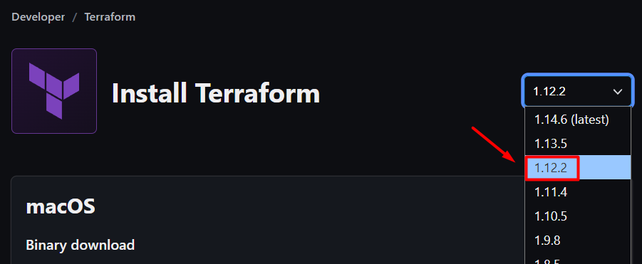
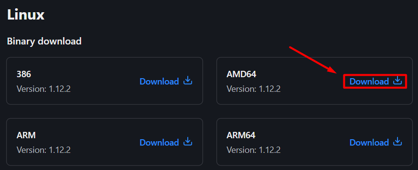
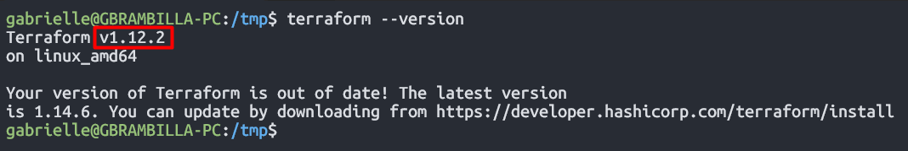

# Terraform Associate 004

This repository aims to document every **Practice Lab** implemented to study and consolidate knowledge for **Hashicorp's Terraform Associate 004 Exam**.

## Installing Terraform 1.12 (Ubuntu)

First, to **validate whether Terraform was installed (or which version is installed)**, the following command was run in the CLI:

```bash
terraform --version
```

Since **Terraform was not recognized as a valid command**, the tool was installed using the steps that can be found in the [Official Installation Guides](https://developer.hashicorp.com/terraform/install).

> [!IMPORTANT]
> Terraform Associate 004 Exam covers topics related to **1.12 version only**:
>
> 

The **correct architecture** was validated using the command below, returning `x86_64` (corresponding to the **AMD64 distribution**):

```bash
uname -m
```



Instead of downloading the file via UI, the following command was executed to **get the binary version with the `wget` command**, implementing the `-P` flag to store it in the `/tmp` directory:

```bash
wget -P /tmp https://releases.hashicorp.com/terraform/1.12.2/terraform_1.12.2_linux_amd64.zip
```

With that, the zip downloaded in the step above was unzipped to **obtain Terraform binary file**:

```bash
unzip /tmp/terraform_1.12.2_linux_amd64.zip
```

Finally, to **make the tool available**, the binary file was moved to the `/usr/bin` path, using the command:

```bash
mv terraform /usr/bin/terraform
```

Running the `terraform --version` command again, this time we've got a success message showing the **correct version used in this environment**: `1.12.2`



The binary path for the `terraform` CLI tool can always be validated using the `which` command:

```bash
which terraform
```

> [!NOTE]
> For **CI/CD and other automations**, the Terraform binary can be found and downloaded at: [Releases | Hashcorp](https://releases.hashicorp.com)